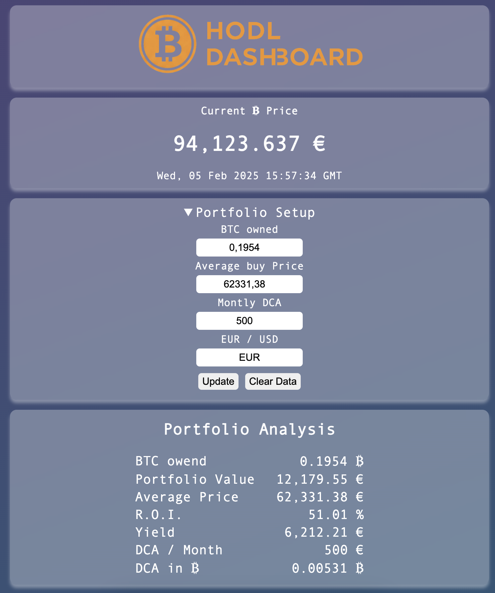

# BTC Portfolio Dashboard
Track your Bitcoin journey quickly and privately.

# Background
I wanted a quick way to track my Bitcoin portfolio data without having to log in somewhere all the time. So I initially created this dashboard using React ([React BTC Dashboard](https://github.com/JetDev22/react-btc-portfolio)).

To be honest I am not the biggest fan of React and started looking for alternatives. This is when I found out about sveltekit. So obviously I used my dashboard idea for my first sveltekit project.

# Deployment
1. Download this repository, run "npm install" and then you can run it on your local computer with "npm run dev"
2. Deploy it to docker
3. Deploy it to your [Coolify.io](https://www.coolify.io) instance on your server or raspberry pi

# My Deployment
I have it running on my hetzner arm server using coolify to deploy it.
You can try it [here](https://tinyurl.com/hodl4life)
